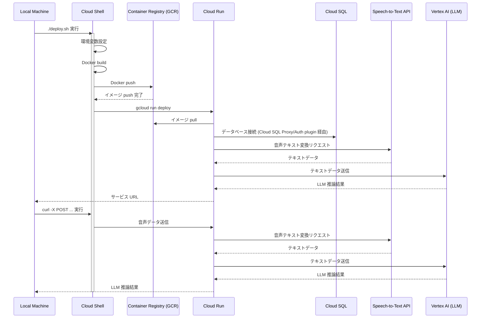

# 議知録

## 前提
- チームメンバ全員同じ開発環境にしたいから、Cloud Shell エディターで開発するよ
- gitで連携

## 使用するツール
### VertexAI
- これで会話を解析させる。

### CLOUD SQL
- MySQL

## シーケンス図^^

```mermaid
sequenceDiagram
    participant Local Machine
    participant Cloud Shell
    participant Container Registry (GCR)
    participant Cloud Run
    participant Cloud SQL
    participant Speech-to-Text API
    participant Vertex AI (LLM)

    Local Machine->>Cloud Shell: ./deploy.sh 実行
    activate Cloud Shell
    Cloud Shell->>Cloud Shell: 環境変数設定
    Cloud Shell->>Cloud Shell: Docker build
    Cloud Shell->>Container Registry (GCR): Docker push
    Container Registry (GCR)-->>Cloud Shell: イメージ push 完了
    Cloud Shell->>Cloud Run: gcloud run deploy
    Cloud Run->>Container Registry (GCR): イメージ pull
    Cloud Run->>Cloud SQL: データベース接続 (Cloud SQL Proxy/Auth plugin 経由)
    Cloud Run->>Speech-to-Text API: 音声テキスト変換リクエスト
    Speech-to-Text API-->>Cloud Run: テキストデータ
    Cloud Run->>Vertex AI (LLM): テキストデータ送信
    Vertex AI (LLM)-->>Cloud Run: LLM 推論結果
    Cloud Run-->>Local Machine: サービス URL
    Local Machine->>Cloud Shell: curl -X POST ... 実行
    Cloud Shell->>Cloud Run: 音声データ送信
    Cloud Run->>Speech-to-Text API: 音声テキスト変換リクエスト
    Speech-to-Text API-->>Cloud Run: テキストデータ
    Cloud Run->>Vertex AI (LLM): テキストデータ送信
    Vertex AI (LLM)-->>Cloud Run: LLM 推論結果
    Cloud Run-->>Local Machine: LLM 推論結果
    deactivate Cloud Shell
```

## GCPプロジェクトの作成手順
### プロジェクトの作成
- 作成後はGUI画面で作成されたことを確認しよう
- 画面右上からCLOUD SHELLを開く
```bash
# PJ一覧の作成：事前確認
gcloud projects list

# gijiroku PJの作成
gcloud projects create <PROJECT_NAME> --set-as-default

# PJ一覧の作成：事後確認
gcloud projects list

# 設定作業中のPJの確認
gcloud config get-value project
# <PROJECT_NAME> が出力されればOK!

```

### 請求の有効化
1. Google Cloud Consoleの「請求」 に移動。
2. 「請求アカウントの管理」 で、作成した請求アカウントを開く。
3. 「プロジェクトをリンク」 をクリックし、<PROJECT_NAME>を選択。
4. CLIでもいける
```bash
# アカウントID確認
gcloud beta billing accounts list

# 有効化確認
### NAME: 請求先アカウント
### OPEN: True
# ならOK
gcloud beta billing projects describe <PROJECT_NAME>

# 有効化
gcloud beta billing projects link <PROJECT_NAME> --billing-account=アカウントID
```


### 必要なAPIの有効化
```bash
# 有効化されているサービス一覧取得
gcloud services list --enabled
```

### Cloud Storageのセットアップ
- 作成したバケットをGCPコンソールで確認
```bash
# 一覧確認
gcloud storage buckets list

# 作成
gcloud storage buckets create gs://{bucket-name} --location={location}
```


###  MySQL データベースインスタンスとユーザーの作成
```bash
# 事前確認
gcloud sql instances list
# インスタンスの作成
# 15分くらいかかるよ
gcloud sql instances create <DB_NAME> --database-version=MYSQL_8_0 --tier=db-f1-micro --region=asia-northeast1

# DB作成
gcloud sql databases create mygichi --instance=<DB_NAME>
# ユーザ作成
gcloud sql users create <USER_NAME> --instance=<DB_NAME> --password=<DB_PASS>

# 事後確認
## インスタンスの確認
gcloud sql instances list
## DBの確認
gcloud sql databases list --instance=<DB_NAME> --format="value(name)"

## 環境変数は開発時はdebugしてる
```

### Cloud Run（バックエンドのデプロイ）
- Cloud Run は コンテナ化されたアプリケーションをGCP上でサーバーレスで実行できるサービス です。
- Flask などの Python アプリを Docker コンテナとしてデプロイ し、GCP 上で動かすことができます。

#### メリット
- サーバーレス → インフラの管理不要（スケール自動化）
- Docker でデプロイ可能 → どんな言語でも動かせる
- HTTPS対応 → 自動的に公開URLが発行される


```bash
# ファイル構成
cloud-run-backend/
│── app.py            # Flaskアプリ
│── requirements.txt  # 必要なPythonパッケージ
│── Dockerfile        # Cloud Run用のDockerファイル
│── .dockerignore     # Dockerの不要ファイルを除外
│── templates/        # 🔹 `index.html` はここに配置
│   ├── index.html    # フロントエンドページ
│── static/           # 🔹 CSS, JS などを格納
│   ├── styles.css    # スタイルシート（任意）
│   ├── script.js     # JavaScriptファイル（任意）
```


## デバッグ
- 過去10件のログを出力するよ^^
- ChatGPTとGeminiにぶち込む
```
gcloud logging read "severity>=ERROR" --limit 10
```
